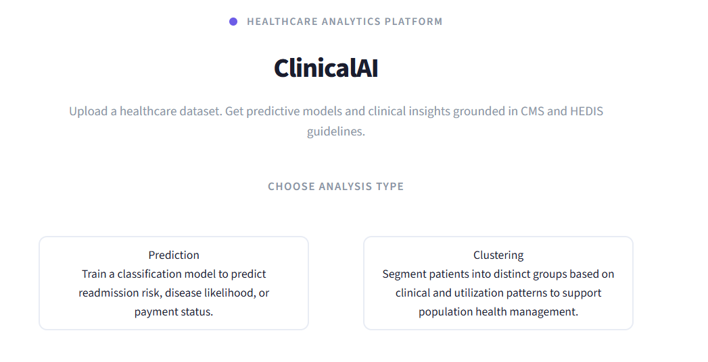

# ClinicalAI

An agentic AI system that takes any healthcare dataset, automatically trains the most appropriate machine learning model, and generates clinical insight  reports grounded in US quality standards through a RAG pipeline.

## What It Does

- Upload any healthcare CSV dataset and describe your use case
- Choose between Prediction and Clustering
- The system selects and trains the appropriate model
- A RAG pipeline retrieves relevant guidelines from a curated knowledge base
- Generates a clinical insight report with cited TPO recommendations

## Setup

1. Clone the repository
2. Create a virtual environment and activate it
3. Install dependencies:
   pip install -r requirements.txt
4. Create a .env file in the root folder with a OpenRouter API key
   
5. Run the app:
   streamlit run app.py

## Knowledge Base

The RAG pipeline uses five curated documents covering US payer regulatory and quality standards including CMS Program Integrity guidelines, HEDIS measure specifications, Transitional Care Management, and Chronic Care Management requirements.

## Tech Stack

- Streamlit 
- DeepSeek V4 Flash via OpenRouter 
- scikit-learn and XGBoost
- ChromaDB and sentence-transformers